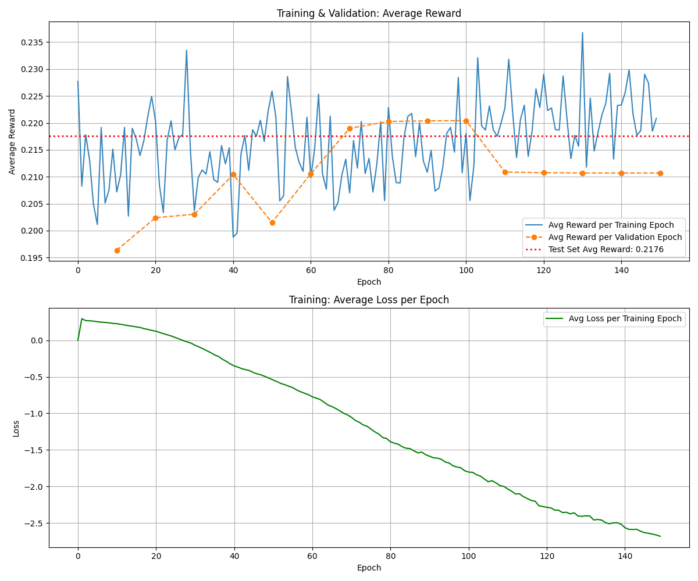
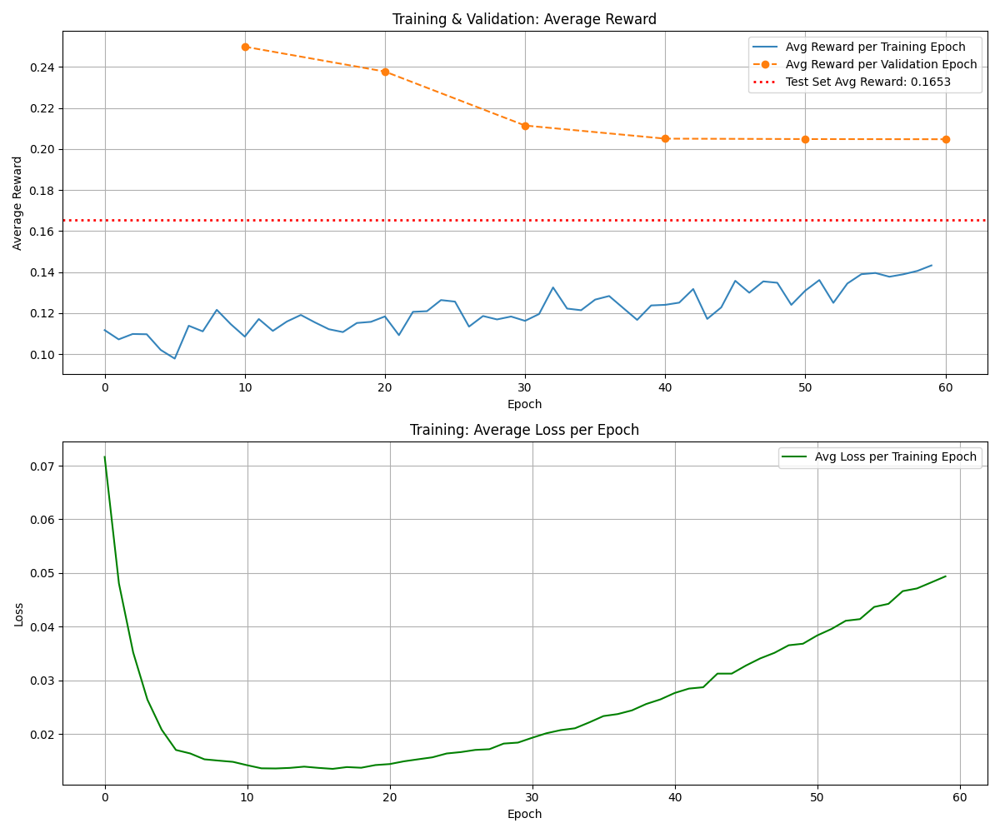
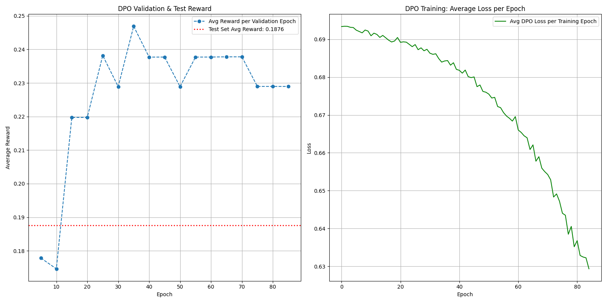

# Offline-RL-Recommender-System

## 项目简介

本项目为**基于离线强化学习的智能众包任务推荐系统**，支持多种主流RL算法（CQL、DDQN、DQN、DPO），采用统一的模块化架构，便于扩展、对比和生产部署。

- 支持一体化训练脚本，命令行参数灵活切换算法与配置。
- 数据、特征、网络结构、算法实现全部模块化，易于维护和复用。
- 提供mini数据集，便于快速验证训练流程。

---

## 目录结构

```
├── train_cql_refactored.py      # 主训练脚本（支持所有算法）
├── src/
│   ├── algorithms/              # 各RL算法实现（CQL/DDQN/DQN/DPO）
│   ├── models/                  # 通用Q/策略网络（GeneralQNetwork）
│   └── data/                    # 数据加载、特征工程、校验
├── config/                      # 配置文件（算法/全局/网络等）
├── mini_data/                   # mini测试数据集
├── project/ entry/              # 全量原始数据
├── docs/                        # 归档的实验图片、测试脚本等
├── tests/                       # 单元/集成测试
├── rl_model.pth                 # 最新模型权重
├── README.md                    # 项目说明
└── ...
```

---

## 支持的算法

- **CQL**（Conservative Q-Learning，保守Q学习）
- **DDQN**（Double DQN）
- **DQN**（Deep Q-Network）
- **DPO**（Direct Policy Optimization，直接策略优化）

所有算法均可通过主脚本和参数灵活切换，无需修改代码。

---

## 快速开始

### 1. 环境准备
- 推荐：`Dockerfile` 一键构建（Python 3.8 + PyTorch）
- 或手动安装 requirements.txt（如未提供可根据import补全）

### 2. 数据准备
- 将 `project_list.csv`、`worker_quality.csv`、`project/`、`entry/` 放于根目录
- 快速测试可用 `mini_data/` 目录

### 3. 训练与评估

以mini数据集为例：

```bash
python train_cql_refactored.py --algorithm cql --num-epochs 1 --batch-size 4 --config-file mini_data_config.json
python train_cql_refactored.py --algorithm ddqn --num-epochs 1 --batch-size 4 --config-file mini_data_config.json
python train_cql_refactored.py --algorithm dqn --num-epochs 1 --batch-size 4 --config-file mini_data_config.json
python train_cql_refactored.py --algorithm dpo --num-epochs 1 --batch-size 4 --config-file mini_data_config.json
```

- 训练结果、模型权重、训练曲线等均自动保存。
- 可通过 `--plot-results` 生成训练过程可视化。

---

## 实验结果与模型对比

本项目对比了多种强化学习算法在真实众包推荐任务上的表现，核心实验结果如下：

| 算法   | 最终测试集奖励 | 训练稳定性   | 核心优势           |
|--------|:-------------:|:------------:|:------------------|
| **CQL**| **0.2176**    | 高度稳定     | 性能与可靠性最佳   |
| DPO    | 0.1876        | 稳定         | 训练效率高         |
| DDQN   | ~0.1653       | 严重过拟合   | 算法经典           |

- **CQL**（保守Q学习）在所有算法中表现最优，训练过程高度稳定，彻底消除了过拟合问题。
- **DPO**（直接策略优化）作为策略型离线算法，训练效率高，但最终性能略逊于CQL。
- **DDQN**（Double DQN）作为经典在线RL算法，在离线场景下易过拟合，表现不佳。

### 训练曲线对比

> 下图为各算法在训练过程中的奖励变化曲线（已归档于`docs/`目录，GitHub可直接预览）：

- 
- 
- 

### 结论

- **CQL（alpha=0.1）** 是本项目最优解决方案，兼具高性能与高可靠性，适合真实世界离线推荐系统。
- DPO为可行的策略型备选方案。
- 经典DDQN等在线算法不适合直接用于离线推荐。

---

## 主要特性与亮点
- **一体化训练入口**，支持所有主流RL算法，便于横向对比和实验复现。
- **模块化设计**，算法、网络、特征、数据完全解耦，易于扩展新算法。
- **高效数据管道**，支持大规模数据与mini数据快速切换。
- **丰富的配置系统**，支持命令行/文件/代码多层覆盖。
- **自动化测试与数据校验**，保证实验可靠性。

---

## 贡献与扩展
- 欢迎PR新算法、特征工程、实验脚本等。
- 如有问题请提交issue或联系作者。

---

## 致谢
- 本项目参考并复现了多篇RL与推荐系统领域的前沿论文。
- 感谢所有开源社区的贡献者！
